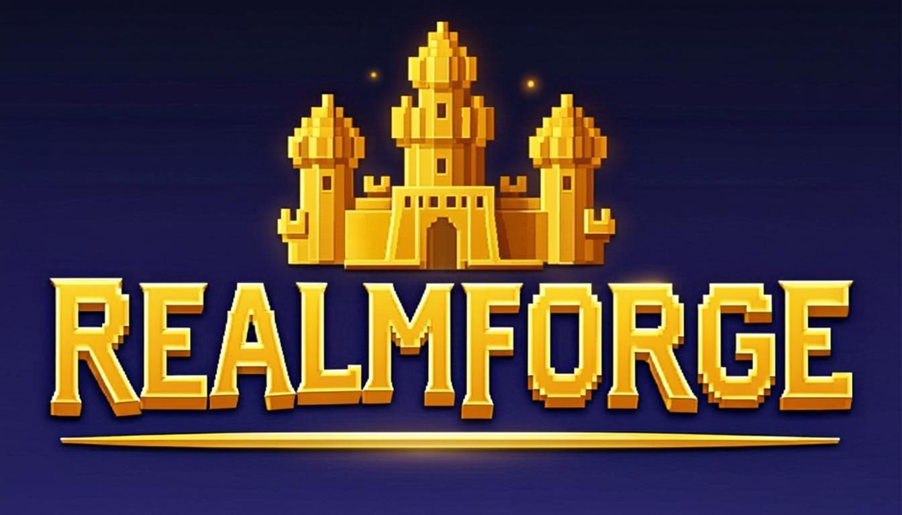

# REALMFORGE ⚒️

An infinite pixel-art **city-builder clicker** game. Tap to forge an endless
dark-navy pixel kingdom across 8 biomes, build combos, click floating coin
bonuses, and Ascend for permanent Relics. Built with Next.js 16 + TypeScript.



## 🎮 Gameplay

- **Tap** the world to build pixel towers — each structure rises from the
  ground with scaffolding, lit windows, and a progress bar.
- **Combos** (tap fast → up to ~2.8× multiplier) and **critical strikes**.
- **7 upgrades**: Hammer Power, Coin Polish, Town Treasury, Master Stroke,
  Critical Force, Builder's Rhythm, Auto Builder.
- **Clickable bonuses**: floating 🪙 / 💎 / ⭐ appear every 3–6s — tap them
  for bonus coins.
- **Ascend** (prestige): reset for permanent Relics (+3% global each).
- **16 achievements**, **7-day daily streak**, local leaderboard.
- **Hard difficulty**: first ascension takes hours (not minutes).

## 💰 Monetization (CrazyGames-ready)

Three **rewarded-ad** placements (Power Surge 3× / offline double / combo
restore) wired to the CrazyGames SDK with an automatic **dev fallback** that
simulates the ad when the SDK isn't present. Plus a premium **Relics** shop
(themes + permanent boosts).

## 🚀 Quick start (development)

```bash
bun install
bun run dev      # http://localhost:3000
```

## 📦 Build for CrazyGames (static export)

```bash
bun run build:static
```

This produces a self-contained **`out/`** folder (static HTML/CSS/JS, no
server needed). **Zip the `out/` folder** and upload it at
<https://developer.crazygames.com>.

### CrazyGames upload checklist

1. Run `bun run build:static`
2. Zip the contents of `out/` (so `index.html` is at the zip root)
3. Go to <https://developer.crazygames.com> → **Submit Game**
4. Upload the zip
5. Fill in metadata:
   - **Title:** REALMFORGE
   - **Description:** Infinite pixel-art city-builder — tap to forge an
     endless dark-navy kingdom, build combos, click bonuses, and Ascend.
   - **Tags:** clicker, idle, pixel art, city builder, incremental
   - **Icon:** `public/realmforge-icon.png`
   - **Cover:** `public/realmforge-logo.png`
6. The CrazyGames SDK (`crazygames-sdk-v3.js`) is already loaded in
   `src/app/layout.tsx`; rewarded ads will activate automatically once
   hosted on CrazyGames.
7. Submit for review (approval typically 2–7 days).

## 🧱 Tech stack

- **Next.js 16** (App Router, static export) + **TypeScript 5**
- **Tailwind CSS 4** + **shadcn/ui** (New York)
- **Zustand** (game state) + **Canvas 2D** (pixel-art renderer)
- **Web Audio API** (synthesized chiptune — no audio asset files)
- **Pixel fonts**: Press Start 2P + VT323 (via `next/font`)
- **localStorage** persistence (no backend required — CrazyGames compliant)

## 📂 Project structure

```
src/
├── app/
│   ├── layout.tsx          # CrazyGames SDK script + pixel fonts
│   └── page.tsx            # main game shell
├── components/game/
│   ├── GameCanvas.tsx      # pixel-art city renderer (tall towers, skyline)
│   ├── ScoreHud.tsx        # top stats bar
│   ├── UpgradePanel.tsx    # 7 upgrades
│   ├── ShopPanel.tsx       # Relics shop (themes + perm boosts)
│   ├── AscendPanel.tsx     # prestige
│   ├── Leaderboard.tsx     # local ranks
│   ├── Achievements.tsx    # 16 quests
│   ├── BonusOverlay.tsx    # floating clickable coin/gem/star bonuses
│   ├── RewardedAdModal.tsx # CrazyGames SDK rewarded ads (+ dev fallback)
│   ├── DailyStreak.tsx     # 7-day streak
│   ├── NameDialog.tsx      # first-run name picker
│   ├── Toasts.tsx          # notifications
│   └── GameFooter.tsx      # sticky footer (streak + ad buttons)
└── lib/
    ├── game/
    │   ├── config.ts       # biomes, buildings (procedural towers), upgrades, achievements
    │   ├── engine.ts       # game math (tap, build, crit, ascend)
    │   ├── audio.ts        # chiptune Web Audio engine
    │   ├── save.ts         # localStorage persistence
    │   └── types.ts        # TypeScript types
    └── store/gameStore.ts  # Zustand store (all game logic)
```

## 📝 License

MIT — original work, no third-party copyrighted assets.
